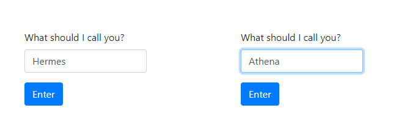
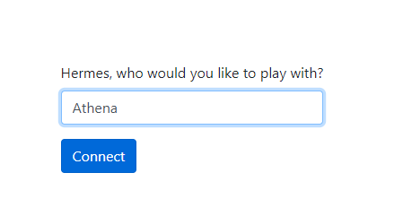
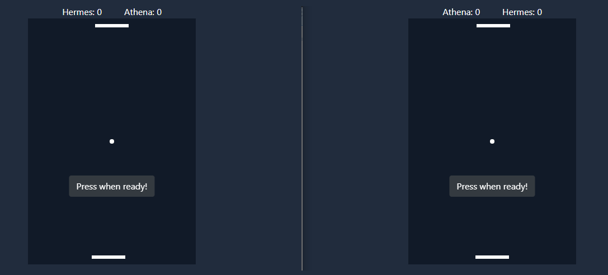

# Pong
 Two players pong over WebRTC
 
 [Live demo](https://ron828.com/pong)
 
 ## How to play
 Two players needed on two different devices.
 
 1. Each player picks a name:
 
 
 
 2. One of the players connects to the other:
 
 
 
 3. The game begins when both players press on the ready button:
 
 
 
